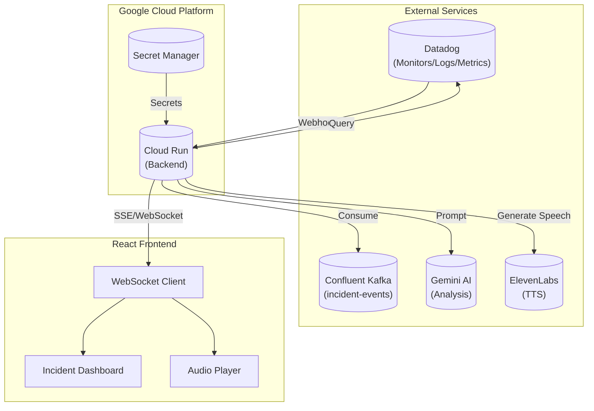
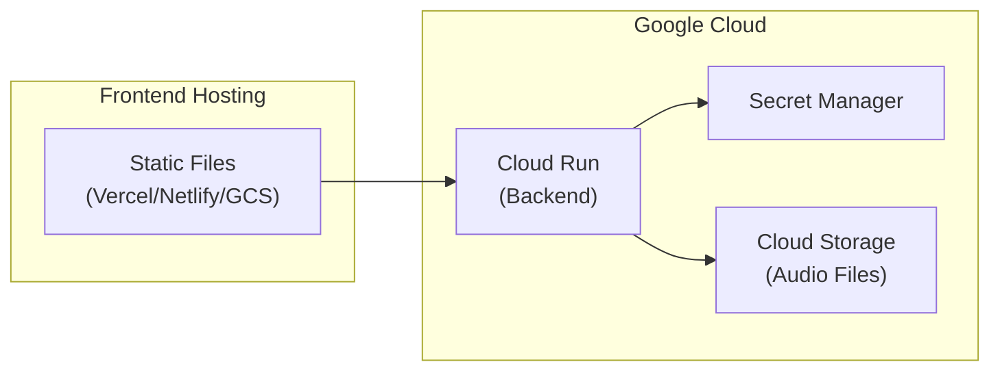

# Incident Sensei — System Architecture

## Executive Summary
Incident Sensei is a real-time, voice-enabled incident detection and analysis platform. This document outlines the technical architecture, component interactions, and implementation strategy for the hackathon.

---

## High-Level Architecture



---

## Component Details

### 1. Backend Service (FastAPI on Cloud Run)

**Technology**: Python 3.11+ with FastAPI

**Responsibilities**:
| Module | Description |
|--------|-------------|
| `webhook_handler` | Receives Datadog webhooks, validates payloads |
| `datadog_client` | Queries Datadog Metrics/Logs APIs |
| `kafka_consumer` | Consumes events from Confluent Kafka |
| `gemini_analyzer` | Builds prompts and calls Gemini API |
| `elevenlabs_tts` | Converts text summaries to speech |
| `notification_service` | Pushes updates via SSE/WebSocket |

**Directory Structure**:
```
backend/
├── app/
│   ├── __init__.py
│   ├── main.py                 # FastAPI app entry
│   ├── config.py               # Environment configuration
│   ├── models/
│   │   ├── incident.py         # Incident data models
│   │   └── webhook.py          # Webhook payload models
│   ├── routers/
│   │   ├── webhook.py          # Datadog webhook endpoints
│   │   ├── incidents.py        # Incident CRUD endpoints
│   │   └── health.py           # Health check endpoints
│   ├── services/
│   │   ├── datadog_service.py  # Datadog API integration
│   │   ├── kafka_service.py    # Kafka consumer logic
│   │   ├── gemini_service.py   # Gemini AI analysis
│   │   ├── tts_service.py      # ElevenLabs TTS
│   │   └── incident_processor.py # Orchestration logic
│   └── utils/
│       ├── auth.py             # Webhook signature validation
│       └── logger.py           # Structured logging
├── requirements.txt
├── Dockerfile
└── tests/
    ├── test_webhook.py
    ├── test_datadog.py
    ├── test_kafka.py
    └── test_gemini.py
```

---

### 2. Frontend (React Dashboard)

**Technology**: React 18+ with Vite, TypeScript

**Key Features**:
- Real-time incident list with severity indicators
- Audio player for voice alerts
- SSE/WebSocket for live updates
- Responsive design for demo visibility

**Directory Structure**:
```
frontend/
├── src/
│   ├── main.tsx
│   ├── App.tsx
│   ├── components/
│   │   ├── IncidentCard.tsx
│   │   ├── IncidentList.tsx
│   │   ├── AudioPlayer.tsx
│   │   ├── StatusBadge.tsx
│   │   └── Header.tsx
│   ├── hooks/
│   │   ├── useIncidents.ts     # Incident state management
│   │   └── useSSE.ts           # Server-sent events hook
│   ├── services/
│   │   └── api.ts              # Backend API client
│   ├── types/
│   │   └── incident.ts         # TypeScript interfaces
│   └── styles/
│       └── index.css
├── index.html
├── package.json
├── vite.config.ts
└── tsconfig.json
```

---

### 3. External Integrations

#### Datadog
| Integration Point | Purpose |
|-------------------|---------|
| Webhooks | Receive monitor alerts |
| Metrics API | Query service metrics |
| Logs API | Fetch relevant log entries |

#### Confluent Kafka
| Topic | Purpose |
|-------|---------|
| `incident-events` | Business events for correlation |

#### Gemini AI
| Feature | Usage |
|---------|-------|
| Analysis Prompt | Incident context → root cause + recommendations |
| Model | `gemini-1.5-flash` for low latency |

#### ElevenLabs
| Feature | Usage |
|---------|-------|
| TTS API | Convert incident summary to speech audio |

---

## Data Flow

sequenceDiagram
    participant DD as Datadog
    participant BE as Backend
    participant KF as Kafka
    participant GM as Gemini (v2.5)
    participant EL as ElevenLabs
    participant FE as Frontend

    %% 1. Incident Trigger
    DD->>BE: POST /api/v1/webhook/datadog (Payload)
    activate BE
    
    %% 2. Context Gathering (Serial)
    BE->>DD: GET /api/v1/query (Metrics)
    BE->>DD: GET /api/v1/events (Logs)
    BE->>KF: Poll internal event buffer
    
    %% 3. AI Analysis
    BE->>GM: Generate Content (Prompt with Context)
    GM-->>BE: JSON Analysis (Root Cause + Summary)
    
    %% 4. Voice Generation
    BE->>EL: POST /v1/text-to-speech (Summary)
    EL-->>BE: Audio Stream (MP3)
    BE->>BE: Save MP3 to /static/audio/
    
    deactivate BE
    
    %% 5. Frontend Polling
    loop Every 2 Seconds
        FE->>BE: GET /api/v1/incidents/
        BE-->>FE: JSON List (Incidents + Audio URL)
    end
    
    %% 6. Playback
    opt New Incident Detected
        FE->>FE: Auto-play Audio URL
    end

---

## API Design

### Backend Endpoints

| Method | Endpoint | Description |
|--------|----------|-------------|
| POST | `/api/v1/webhook/datadog` | Receive Datadog alerts |
| GET | `/api/v1/incidents` | List all incidents |
| GET | `/api/v1/incidents/{id}` | Get incident details |
| GET | `/api/v1/incidents/{id}/audio` | Get audio file |
| GET | `/api/v1/stream` | SSE endpoint for live updates |
| GET | `/health` | Health check |

### Incident Model

```json
{
  "id": "inc-12345",
  "title": "High Error Rate in orders-service",
  "severity": "critical",
  "source": "datadog",
  "status": "active",
  "timestamp": "2024-12-08T21:00:00Z",
  "metrics": { ... },
  "logs": [ ... ],
  "kafka_events": [ ... ],
  "analysis": {
    "summary": "...",
    "root_cause": "...",
    "recommendations": [ ... ]
  },
  "audio_url": "/api/v1/incidents/inc-12345/audio"
}
```

---

## Deployment Architecture



### Environment Variables

| Variable | Description |
|----------|-------------|
| `DATADOG_API_KEY` | Datadog API key |
| `DATADOG_APP_KEY` | Datadog App key |
| `CONFLUENT_BOOTSTRAP_SERVERS` | Kafka bootstrap servers |
| `CONFLUENT_API_KEY` | Confluent API key |
| `CONFLUENT_API_SECRET` | Confluent API secret |
| `GEMINI_API_KEY` | Google AI API key |
| `ELEVENLABS_API_KEY` | ElevenLabs API key |
| `WEBHOOK_SECRET` | Datadog webhook signature secret |

---

## Security Considerations

1. **Webhook Validation**: Verify Datadog HMAC signatures
2. **Secret Management**: All keys in GCP Secret Manager
3. **HTTPS Only**: All traffic encrypted
4. **CORS**: Restricted to frontend origin

---

## Scalability & Performance

| Requirement | Solution |
|-------------|----------|
| Latency < 5s | Parallel API calls, Gemini Flash model |
| Audio < 3s | ElevenLabs optimized voice |
| Stateless | Cloud Run auto-scaling |
| Real-time | SSE for low-overhead streaming |

---

## Technology Stack Summary

| Layer | Technology |
|-------|------------|
| Backend | Python 3.11, FastAPI, Uvicorn |
| Frontend | React 18, TypeScript, Vite |
| AI | Google Gemini 1.5 Flash |
| TTS | ElevenLabs API |
| Monitoring | Datadog |
| Streaming | Confluent Kafka |
| Cloud | Google Cloud Run |
| Secrets | GCP Secret Manager |

---

## Hackathon-Specific Optimizations

1. **Mock Mode**: Ability to simulate incidents without Datadog
2. **Demo Script**: Pre-configured incident triggers
3. **Visual Polish**: Dark theme dashboard for demo impact
4. **Clear Metrics**: Visible latency timers on UI
