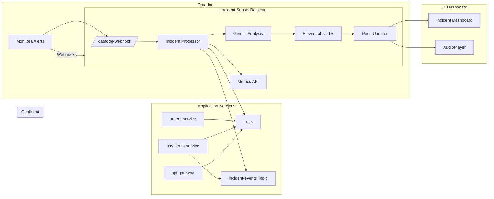

# Incident Sensei — Product Requirements Document (PRD)

## 1. Overview
Incident Sensei is a real-time, voice-enabled incident detection and analysis platform for engineering and SRE teams. It integrates Datadog, Confluent (Kafka), Google Cloud (Gemini / Cloud Run), and ElevenLabs to provide intelligent incident detection, voice alerts, and root-cause reasoning.

## 2. Goals and Non-Goals
### Goals
- Provide automated incident alerting using Datadog + Confluent signal correlation.
- Voice-based incident explanation via ElevenLabs.
- Intelligent summaries using Gemini.
- Dashboard displaying metrics, logs, and events.

### Non-Goals
- Large-scale service discovery.
- Full on-call rotation tooling.
- Long-term historical analytics.

## 3. Target Users
- SRE / DevOps Engineers
- Engineering Managers
- Hackathon judges seeking real-time AI systems

## 4. Use Case Scenarios
### UC-1: Real-Time Incident Detection
Datadog monitor fires, Sensei processes alert, and generates a spoken summary.

### UC-2: Root-Cause Summary
Gemini analyzes logs/metrics/events and produces insights.

### UC-3: Voice Notification
ElevenLabs generates a spoken incident alert.

### UC-4: Dashboard Updates
UI displays incident details.

---

## 5. Functional Requirements
### Incident Intake
- Receive Datadog webhooks.
- Validate alert payload.

### Data Correlation
- Query Datadog metrics/logs.
- Read Kafka events from `incident-events`.

### AI Analysis
- Send structured prompt to Gemini.
- Generate summary + root cause + recommendations.

### Voice Output
- Convert summary to speech via ElevenLabs.

### Frontend
- Display active incidents.
- Play audio through browser.
- Auto-update through WebSockets/SSE.

---

## 6. System Architecture

### Components
- **Datadog**: Alerts + metrics/logs
- **Confluent Kafka**: Real-time event stream
- **Backend (FastAPI/Cloud Run)**: Orchestration + LLM pipeline
- **Gemini**: AI analysis
- **ElevenLabs**: TTS
- **React Frontend**: Dashboard

### High-Level Diagram (Mermaid)

---

## 7. Architecture Approach
- Stateless backend on Cloud Run.
- Datadog Webhook → incident pipeline.
- Kafka consumer for business events.
- Gemini for AI reasoning.
- ElevenLabs for voice notifications.

---

## 8. Test Plan
### Unit Tests
- Datadog webhook validation.
- Metrics/logs API wrappers.
- Kafka consumer parsing.
- Gemini prompt builder.
- TTS wrapper.

### Integration Tests
- Datadog → Backend
- Backend → Datadog APIs
- Backend → Kafka
- Backend → Gemini
- Backend → ElevenLabs

### E2E Tests
- Trigger incident → voice alert generated.

### Failure Testing
- Datadog API unavailable → fallback summary.
- Kafka unavailable → partial context.

---

## 9. Non-Functional Requirements
- Latency: incident processing < 5 seconds.
- Audio generation <3 seconds.
- Scalable stateless backend.
- Secure key storage (GCP Secret Manager).

---

## 10. Demo Script
1. Show dashboard (healthy).
2. Trigger incident.
3. Datadog alert fires.
4. Incident Sensei produces summary + voice alert.
5. Dashboard updates in real-time.
6. Optional: “Sensei, what services are impacted?”

---

## 11. Success Metrics
- End-to-end demo runs smoothly.
- Voice alert generated <5 seconds.
- Judges able to clearly see correlated signals.
